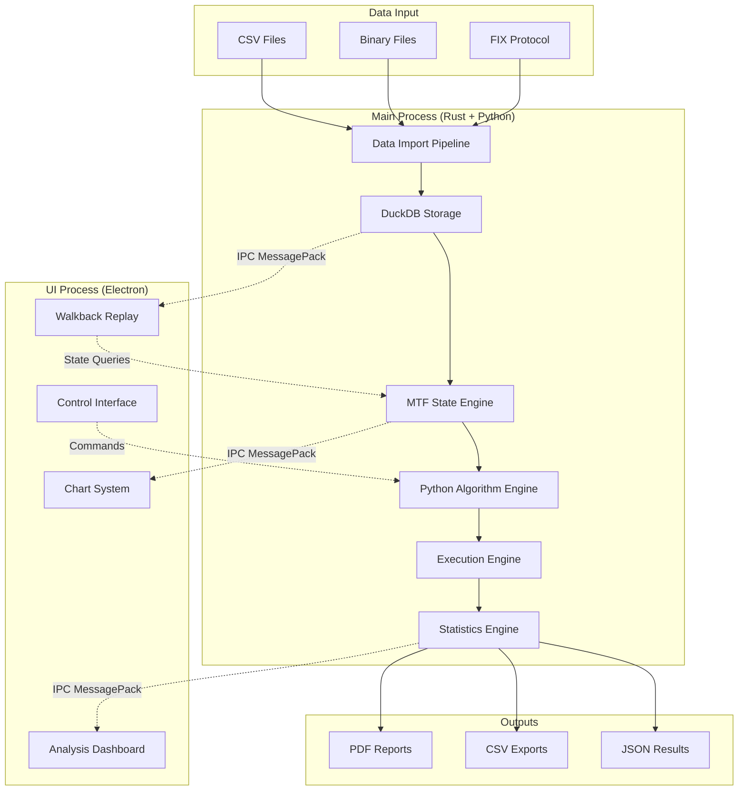

# System Overview

## High-Level Architecture Overview

BackTestr_ai employs a revolutionary hybrid desktop architecture that maximizes performance for financial data processing while maintaining UI responsiveness. The system consists of two primary processes: a high-performance main process combining Rust and embedded Python for computational tasks, and a separate Electron UI process for responsive user interaction.

The architecture's core innovation is the Multi-Timeframe (MTF) State Engine running in Rust, which maintains synchronized partial and completed bar states across six timeframes (1m, 5m, 15m, 1H, 4H, Daily) at every tick. This enables algorithmic strategies to query market structure exactly as they would in live trading, eliminating the fundamental synchronization problem that causes 70-80% of backtesting platforms to fail in live markets.

Python algorithms are embedded directly into the Rust process via PyO3, eliminating IPC overhead for indicator calculations while providing familiar syntax for traders. DuckDB is embedded for columnar tick data storage with 10-20x compression ratios, and Lightweight Charts provides institutional-grade visualization across six synchronized panels.

The system processes up to 1 million ticks per second while maintaining sub-100 microsecond MTF state updates and 60 FPS chart rendering, delivering institutional-level accuracy without the associated costs or complexity.

## Major Components and Their Relationships

### 1. Main Process (Rust + Embedded Python)
- **Core Engine (Rust)**: Tick processing, MTF state management, position tracking, and execution modeling
- **Python Bridge (PyO3)**: Embedded Python interpreter for algorithm execution and custom indicators
- **Database Layer (DuckDB)**: Embedded columnar database for tick data storage and historical queries
- **Statistics Engine**: Real-time calculation of performance metrics, P&L, and risk analytics

### 2. UI Process (Electron + React)
- **Chart System**: Six-panel synchronized chart layout using Lightweight Charts
- **Control Interface**: Algorithm configuration, backtest controls, and walkback replay
- **Analysis Dashboard**: Performance metrics, trade tables, and heatmap visualizations
- **Data Management**: Import/export interfaces and data quality monitoring

### 3. Inter-Process Communication
- **MessagePack Protocol**: High-performance serialization for data exchange
- **Batched Updates**: UI updates throttled to 60 FPS regardless of tick processing speed
- **State Synchronization**: Replay state and chart data synchronized across processes

### 4. Data Storage Layer
- **Tick Data Storage**: Partitioned by date with microsecond precision timestamps
- **Bar Cache**: Pre-computed OHLC bars for common timeframes
- **Backtest Results**: Complete trade history, position tracking, and performance metrics
- **Configuration Storage**: Algorithm code, test scenarios, and user preferences

## Data Flow Between Components

### Detailed Data Flow Sequence

1. **Data Ingestion**: Raw tick data enters through the import pipeline, supporting CSV, binary, and FIX protocol formats
2. **Storage**: Data is stored in DuckDB with columnar compression and date-based partitioning
3. **MTF Processing**: Each tick updates all relevant timeframe states atomically in the MTF engine
4. **Algorithm Execution**: Python algorithms query MTF state and make trading decisions
5. **Position Management**: The execution engine manages multiple concurrent positions with realistic slippage
6. **Statistics**: Real-time calculation of performance metrics and trade analytics
7. **UI Updates**: Batched state updates sent to UI process via MessagePack for chart rendering
8. **User Interaction**: UI controls send commands back to main process for algorithm configuration and replay control

## Key Architectural Patterns Used

### 1. **Hybrid Process Architecture**
- **Rationale**: Separates CPU-intensive financial calculations from UI rendering to prevent blocking
- **Implementation**: Main process handles all computational work while UI process focuses on responsiveness
- **Benefits**: Maximum performance for tick processing while maintaining 60 FPS chart updates

### 2. **Embedded Database Pattern**
- **Rationale**: Eliminates network latency and connection management overhead for time-series queries
- **Implementation**: DuckDB embedded directly in main process with memory-mapped file access
- **Benefits**: Zero-copy data access and columnar storage optimized for analytical queries

### 3. **Multi-Timeframe State Synchronization**
- **Rationale**: Ensures algorithms see accurate market structure across all timeframes at any moment
- **Implementation**: Atomic updates to all affected timeframes per tick with partial bar tracking
- **Benefits**: Eliminates look-ahead bias and provides deterministic backtest results

### 4. **Language Bridge Pattern (PyO3)**
- **Rationale**: Combines Rust performance with Python's algorithmic development ecosystem
- **Implementation**: Python interpreter embedded in Rust process with zero-copy data sharing
- **Benefits**: <10% performance overhead while enabling familiar Python syntax for traders

### 5. **Replay Engine Pattern**
- **Rationale**: Enables visual debugging of algorithm decisions for strategy validation
- **Implementation**: State snapshots captured at each tick with controllable playback speed
- **Benefits**: Frame-by-frame analysis of trading decisions and market conditions

### 6. **Batched IPC Pattern**
- **Rationale**: Minimizes communication overhead between high-frequency main process and UI
- **Implementation**: MessagePack serialization with updates throttled to display refresh rate
- **Benefits**: Maintains UI responsiveness during million-tick-per-second processing

### 7. **Component-Based UI Architecture**
- **Rationale**: Enables synchronized chart interactions across multiple timeframe panels
- **Implementation**: React components with shared state management and event coordination
- **Benefits**: Consistent user experience across complex multi-panel interface

### 8. **Repository Pattern for Data Access**
- **Rationale**: Abstracts database operations and enables testing with mock data
- **Implementation**: Rust traits defining data access contracts with DuckDB implementation
- **Benefits**: Clean separation of concerns and easier unit testing

These patterns work together to create a system that achieves institutional-grade accuracy and performance while remaining maintainable and extensible for future enhancements.
