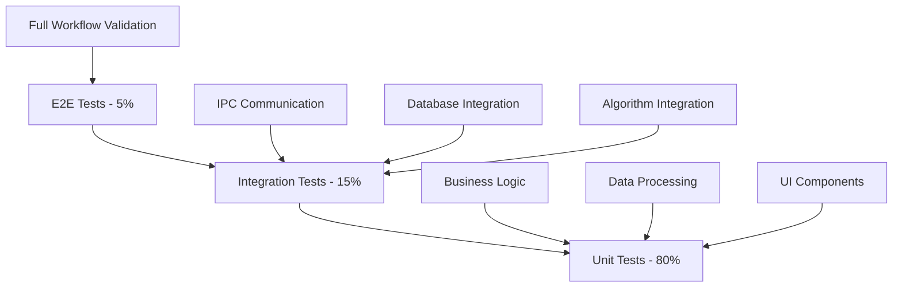

# Testing Strategy

## Overview

The testing strategy for BackTestr_ai is designed to ensure the highest levels of accuracy, reliability, and performance for financial applications. Given the multi-language architecture (Rust, Python, TypeScript) and critical nature of financial computations, our approach implements comprehensive testing across all system layers with special emphasis on numerical precision and real-time performance validation.

## 1. Testing Philosophy

### Testing Pyramid Approach



**Inverted Pyramid for Financial Accuracy**:
- **80% Unit Tests**: Comprehensive coverage of mathematical operations, data transformations, and business logic
- **15% Integration Tests**: Focus on IPC communication, data flow between components, and algorithm execution
- **5% End-to-End Tests**: Critical user workflows and complete system validation

### Quality Gates and Testing Standards

```rust
// Quality gates configuration
pub struct QualityGates {
    unit_test_coverage: f64,      // Minimum 90%
    integration_coverage: f64,    // Minimum 85%
    performance_threshold: Duration, // Max 100ms for critical paths
    numerical_precision: f64,     // 1e-8 for financial calculations
    memory_leak_tolerance: usize, // 0 bytes for 24h stress test
}

impl Default for QualityGates {
    fn default() -> Self {
        Self {
            unit_test_coverage: 0.90,
            integration_coverage: 0.85,
            performance_threshold: Duration::from_millis(100),
            numerical_precision: 1e-8,
            memory_leak_tolerance: 0,
        }
    }
}
```

**Quality Standards**:
- **Code Coverage**: 90% unit test coverage, 85% integration coverage
- **Performance Gates**: All critical paths must complete within 100ms
- **Numerical Precision**: Financial calculations accurate to 8 decimal places
- **Memory Safety**: Zero memory leaks in 24-hour stress tests
- **Security Testing**: All IPC channels and data storage mechanisms validated

## 2. Unit Testing Strategy

### Rust Core Engine Testing

```rust
// tests/unit/mtf_engine_test.rs
use backtestr_core::engine::MTFEngine;
use proptest::prelude::*;
use std::time::Duration;

#[cfg(test)]
mod mtf_engine_tests {
    use super::*;
    
    #[test]
    fn test_bar_aggregation_accuracy() {
        let mut engine = MTFEngine::new();
        let ticks = generate_test_ticks(1000);
        
        for tick in ticks.iter() {
            engine.process_tick(tick);
        }
        
        let m1_bars = engine.get_bars(TimeFrame::M1, 10);
        let m5_bars = engine.get_bars(TimeFrame::M5, 2);
        
        // Verify M5 bars are properly aggregated from M1 bars
        assert_eq!(m5_bars[0].volume, 
                  m1_bars[0..5].iter().map(|b| b.volume).sum());
        
        // Verify OHLC integrity
        assert_eq!(m5_bars[0].open, m1_bars[0].open);
        assert_eq!(m5_bars[0].close, m1_bars[4].close);
        assert_eq!(m5_bars[0].high, 
                  m1_bars[0..5].iter().map(|b| b.high).fold(0.0, f64::max));
    }
    
    // Property-based testing for edge cases
    proptest! {
        #[test]
        fn prop_price_ordering_invariant(
            prices in prop::collection::vec(1.0..10.0f64, 100..1000)
        ) {
            let ticks = create_ticks_from_prices(prices);
            let mut engine = MTFEngine::new();
            
            for tick in ticks {
                engine.process_tick(&tick);
            }
            
            let bars = engine.get_bars(TimeFrame::M1, 100);
            
            // Property: All bars must maintain OHLC ordering
            for bar in bars {
                prop_assert!(bar.low <= bar.open);
                prop_assert!(bar.low <= bar.high);
                prop_assert!(bar.low <= bar.close);
                prop_assert!(bar.high >= bar.open);
                prop_assert!(bar.high >= bar.close);
            }
        }
    }
    
    #[tokio::test]
    async fn test_concurrent_access_safety() {
        let engine = Arc::new(Mutex::new(MTFEngine::new()));
        let mut handles = vec![];
        
        // Spawn 10 concurrent tasks processing ticks
        for i in 0..10 {
            let engine_clone = Arc::clone(&engine);
            let handle = tokio::spawn(async move {
                let ticks = generate_test_ticks(100);
                for tick in ticks {
                    let mut engine = engine_clone.lock().await;
                    engine.process_tick(&tick);
                }
            });
            handles.push(handle);
        }
        
        // Wait for all tasks to complete
        for handle in handles {
            handle.await.unwrap();
        }
        
        // Verify state consistency
        let engine = engine.lock().await;
        let bars = engine.get_bars(TimeFrame::M1, 100);
        assert!(!bars.is_empty());
        verify_bar_chronological_order(&bars);
    }
}

// Benchmark tests for performance regression detection
#[cfg(test)]
mod benchmarks {
    use super::*;
    use criterion::{black_box, criterion_group, criterion_main, Criterion};
    
    fn benchmark_tick_processing(c: &mut Criterion) {
        let mut engine = MTFEngine::new();
        let ticks = generate_test_ticks(10000);
        
        c.bench_function("process_10k_ticks", |b| {
            b.iter(|| {
                for tick in black_box(&ticks) {
                    engine.process_tick(tick);
                }
            })
        });
    }
    
    fn benchmark_bar_retrieval(c: &mut Criterion) {
        let mut engine = MTFEngine::new();
        let ticks = generate_test_ticks(100000);
        
        for tick in ticks {
            engine.process_tick(&tick);
        }
        
        c.bench_function("get_1000_bars", |b| {
            b.iter(|| {
                black_box(engine.get_bars(TimeFrame::M1, 1000));
            })
        });
    }
    
    criterion_group!(benches, benchmark_tick_processing, benchmark_bar_retrieval);
    criterion_main!(benches);
}
```

### Python Algorithm Testing

```python
# tests/unit/test_algorithm_execution.py
import pytest
import numpy as np
from hypothesis import given, strategies as st
from backtestr_python import AlgorithmExecutor, DataContext

class TestAlgorithmExecution:
    def setup_method(self):
        self.executor = AlgorithmExecutor()
        self.test_data = self.generate_ohlcv_data(1000)
    
    def test_sma_calculation_accuracy(self):
        """Test Simple Moving Average calculation precision."""
        prices = [100.0, 101.0, 102.0, 103.0, 104.0]
        expected_sma = sum(prices) / len(prices)  # 102.0
        
        algorithm = """
def initialize(context):
    context.window_size = 5

def handle_data(context, data):
    if len(data.history('close')) >= context.window_size:
        sma = data.history('close', context.window_size).mean()
        context.last_sma = sma
"""
        
        result = self.executor.run_algorithm(algorithm, self.test_data)
        assert abs(result.context.last_sma - expected_sma) < 1e-8
    
    @given(st.lists(st.floats(min_value=1.0, max_value=1000.0), 
                   min_size=20, max_size=1000))
    def test_portfolio_value_consistency(self, prices):
        """Property-based test for portfolio value calculations."""
        algorithm = """
def initialize(context):
    context.initial_cash = 10000.0

def handle_data(context, data):
    if not context.portfolio.positions:
        order_target_percent('EURUSD', 0.5)
"""
        
        data = self.create_data_from_prices(prices)
        result = self.executor.run_algorithm(algorithm, data)
        
        # Property: Portfolio value should never be negative
        assert result.portfolio.total_value >= 0
        
        # Property: Cash + position value should equal total value
        cash = result.portfolio.cash
        position_value = sum(pos.market_value for pos in result.portfolio.positions.values())
        assert abs((cash + position_value) - result.portfolio.total_value) < 1e-6
    
    def test_algorithm_resource_limits(self):
        """Test that algorithms respect resource constraints."""
        # Memory-intensive algorithm that should be limited
        memory_hog = """
def initialize(context):
    context.data = []

def handle_data(context, data):
    # Try to allocate 100MB of data
    context.data.extend([0] * 25000000)  # ~100MB
"""
        
        with pytest.raises(MemoryError):
            self.executor.run_algorithm(memory_hog, self.test_data, 
                                      memory_limit_mb=50)
    
    def test_numerical_stability(self):
        """Test algorithms handle edge cases and numerical stability."""
        # Test with very small and very large numbers
        extreme_data = self.generate_extreme_value_data()
        
        algorithm = """
def handle_data(context, data):
    price = data.current('close')
    if price > 0:
        log_return = math.log(price / data.history('close', 2)[0])
        context.log_returns.append(log_return)
"""
        
        result = self.executor.run_algorithm(algorithm, extreme_data)
        
        # Verify no NaN or infinite values
        assert all(not math.isnan(r) and math.isfinite(r) 
                  for r in result.context.log_returns)

# Performance profiling tests
class TestAlgorithmPerformance:
    def test_execution_time_limits(self):
        """Ensure algorithms complete within reasonable time limits."""
        start_time = time.time()
        
        algorithm = """
def handle_data(context, data):
    # Simulate computationally intensive operation
    result = sum(i**2 for i in range(1000))
    context.computation_result = result
"""
        
        self.executor.run_algorithm(algorithm, self.test_data)
        execution_time = time.time() - start_time
        
        # Should complete within 1 second for 1000 bars
        assert execution_time < 1.0
    
    def test_memory_usage_tracking(self):
        """Monitor memory usage during algorithm execution."""
        import psutil
        import os
        
        process = psutil.Process(os.getpid())
        initial_memory = process.memory_info().rss
        
        algorithm = """
def initialize(context):
    context.indicators = {}

def handle_data(context, data):
    # Create indicators that should be garbage collected
    for i in range(100):
        context.indicators[f'sma_{i}'] = data.history('close', 20).mean()
    
    # Clear old indicators
    if len(context.indicators) > 50:
        context.indicators.clear()
"""
        
        self.executor.run_algorithm(algorithm, self.test_data)
        final_memory = process.memory_info().rss
        
        # Memory growth should be reasonable (< 100MB)
        memory_growth = (final_memory - initial_memory) / 1024 / 1024
        assert memory_growth < 100
```

### TypeScript Frontend Testing

```typescript
// src/tests/unit/components/ChartContainer.test.tsx
import React from 'react';
import { render, screen, waitFor, fireEvent } from '@testing-library/react';
import userEvent from '@testing-library/user-event';
import { ChartContainer } from '../../../components/charts/ChartContainer';
import { MockWebGLContext, MockCanvasContext } from '../../mocks/canvas';
import { createMockTickData, createMockOHLCVData } from '../../fixtures/market-data';

// Mock WebGL context for chart rendering tests
beforeAll(() => {
    HTMLCanvasElement.prototype.getContext = jest.fn((contextType) => {
        if (contextType === 'webgl' || contextType === 'webgl2') {
            return new MockWebGLContext();
        }
        if (contextType === '2d') {
            return new MockCanvasContext();
        }
        return null;
    });
});

describe('ChartContainer', () => {
    const defaultProps = {
        symbol: 'EURUSD',
        timeframe: 'M1' as const,
        width: 800,
        height: 400
    };
    
    test('renders chart canvas with correct dimensions', () => {
        render(<ChartContainer {...defaultProps} />);
        
        const canvas = screen.getByTestId('chart-canvas');
        expect(canvas).toHaveAttribute('width', '800');
        expect(canvas).toHaveAttribute('height', '400');
    });
    
    test('updates chart when new tick data arrives', async () => {
        const user = userEvent.setup();
        render(<ChartContainer {...defaultProps} />);
        
        const mockTick = createMockTickData({
            symbol: 'EURUSD',
            bid: 1.1234,
            ask: 1.1236,
            timestamp: Date.now()
        });
        
        // Simulate tick data update
        fireEvent(window, new CustomEvent('tick-data', { 
            detail: mockTick 
        }));
        
        await waitFor(() => {
            expect(screen.getByTestId('chart-canvas')).toHaveAttribute(
                'data-last-price', '1.1234'
            );
        });
    });
    
    test('handles zoom operations correctly', async () => {
        const user = userEvent.setup();
        render(<ChartContainer {...defaultProps} />);
        
        const canvas = screen.getByTestId('chart-canvas');
        
        // Simulate wheel zoom
        fireEvent.wheel(canvas, { deltaY: -100 });
        
        await waitFor(() => {
            expect(canvas).toHaveAttribute('data-zoom-level', '1.1');
        });
        
        // Test zoom limits
        for (let i = 0; i < 20; i++) {
            fireEvent.wheel(canvas, { deltaY: -100 });
        }
        
        await waitFor(() => {
            const zoomLevel = parseFloat(canvas.getAttribute('data-zoom-level') || '1');
            expect(zoomLevel).toBeLessThanOrEqual(10); // Max zoom limit
        });
    });
    
    test('renders indicators correctly', async () => {
        const ohlcvData = createMockOHLCVData(100);
        
        render(
            <ChartContainer 
                {...defaultProps} 
                indicators={[
                    { type: 'sma', period: 20, color: '#ff0000' },
                    { type: 'ema', period: 12, color: '#00ff00' }
                ]}
                data={ohlcvData}
            />
        );
        
        await waitFor(() => {
            expect(screen.getByTestId('indicator-sma-20')).toBeInTheDocument();
            expect(screen.getByTestId('indicator-ema-12')).toBeInTheDocument();
        });
    });
    
    test('performance: handles large datasets efficiently', async () => {
        const largeDataset = createMockOHLCVData(10000);
        const startTime = performance.now();
        
        render(<ChartContainer {...defaultProps} data={largeDataset} />);
        
        await waitFor(() => {
            expect(screen.getByTestId('chart-canvas')).toBeInTheDocument();
        });
        
        const renderTime = performance.now() - startTime;
        expect(renderTime).toBeLessThan(1000); // Should render within 1 second
    });
});

// Store testing with mock data
describe('ChartStore', () => {
    test('maintains state consistency during rapid updates', () => {
        const store = useChartStore();
        const tickData = createMockTickData({ symbol: 'EURUSD' });
        
        // Simulate rapid tick updates
        for (let i = 0; i < 1000; i++) {
            const tick = { ...tickData, timestamp: Date.now() + i };
            store.updateTick(tick);
        }
        
        const currentData = store.getCurrentPrice('EURUSD');
        expect(currentData).toBeDefined();
        expect(currentData.timestamp).toBeGreaterThan(tickData.timestamp);
    });
    
    test('handles timeframe switching without data loss', () => {
        const store = useChartStore();
        const ohlcvData = createMockOHLCVData(1000);
        
        store.setData('EURUSD', 'M1', ohlcvData);
        expect(store.getData('EURUSD', 'M1')).toHaveLength(1000);
        
        // Switch timeframes
        store.setTimeframe('M5');
        expect(store.getData('EURUSD', 'M1')).toHaveLength(1000); // M1 data preserved
    });
});
```

## 3. Integration Testing Strategy

### IPC Communication Testing

```rust
// tests/integration/ipc_communication.rs
use backtestr_core::ipc::{IPCServer, IPCClient, Message, MessageType};
use tokio::time::{timeout, Duration};
use std::sync::Arc;

#[tokio::test]
async fn test_ipc_request_response_cycle() {
    let server = IPCServer::new("test_channel").await.unwrap();
    let client = IPCClient::connect("test_channel").await.unwrap();
    
    // Start server handling
    let server_handle = tokio::spawn(async move {
        while let Ok(message) = server.receive().await {
            match message.message_type {
                MessageType::GetMarketData { symbol, timeframe } => {
                    let response = create_mock_market_data(&symbol, timeframe);
                    server.send_response(message.id, response).await.unwrap();
                }
                _ => {}
            }
        }
    });
    
    // Test client request
    let request = Message::new(
        MessageType::GetMarketData {
            symbol: "EURUSD".to_string(),
            timeframe: TimeFrame::M1,
        }
    );
    
    let response = timeout(
        Duration::from_secs(5),
        client.send_request(request)
    ).await.unwrap().unwrap();
    
    assert!(matches!(response.message_type, MessageType::MarketDataResponse { .. }));
    server_handle.abort();
}

#[tokio::test]
async fn test_ipc_error_handling() {
    let client = IPCClient::connect("nonexistent_channel").await;
    assert!(client.is_err());
    
    // Test timeout handling
    let client = IPCClient::connect("test_channel_timeout").await.unwrap();
    let request = Message::new(MessageType::GetMarketData {
        symbol: "INVALID".to_string(),
        timeframe: TimeFrame::M1,
    });
    
    let result = timeout(
        Duration::from_millis(100),
        client.send_request(request)
    ).await;
    
    assert!(result.is_err()); // Should timeout
}

#[tokio::test]
async fn test_ipc_concurrent_requests() {
    let server = IPCServer::new("concurrent_test").await.unwrap();
    let clients: Vec<_> = (0..10).map(|_| {
        IPCClient::connect("concurrent_test")
    }).collect::<Vec<_>>();
    
    // Wait for all clients to connect
    let clients = futures::future::try_join_all(clients).await.unwrap();
    
    // Send concurrent requests
    let requests: Vec<_> = clients.into_iter().enumerate().map(|(i, client)| {
        tokio::spawn(async move {
            let request = Message::new(MessageType::GetMarketData {
                symbol: format!("PAIR{}", i),
                timeframe: TimeFrame::M1,
            });
            client.send_request(request).await
        })
    }).collect();
    
    let results = futures::future::join_all(requests).await;
    
    // All requests should succeed
    for result in results {
        assert!(result.unwrap().is_ok());
    }
}

#[tokio::test]
async fn test_ipc_message_ordering() {
    let server = IPCServer::new("ordering_test").await.unwrap();
    let client = IPCClient::connect("ordering_test").await.unwrap();
    
    // Send messages in sequence
    let mut message_ids = Vec::new();
    for i in 0..100 {
        let request = Message::new(MessageType::GetMarketData {
            symbol: format!("TEST{}", i),
            timeframe: TimeFrame::M1,
        });
        message_ids.push(request.id);
        client.send_request(request).await.unwrap();
    }
    
    // Verify responses come back in order
    let mut received_ids = Vec::new();
    for _ in 0..100 {
        let response = server.receive().await.unwrap();
        received_ids.push(response.id);
    }
    
    assert_eq!(message_ids, received_ids);
}
```

### Database Integration Testing

```rust
// tests/integration/database_integration.rs
use backtestr_core::storage::{DuckDBManager, TickData, OHLCVBar};
use tempfile::TempDir;

#[tokio::test]
async fn test_database_tick_storage_retrieval() {
    let temp_dir = TempDir::new().unwrap();
    let db = DuckDBManager::new(temp_dir.path()).await.unwrap();
    
    // Generate test tick data
    let ticks = generate_test_ticks(10000);
    
    // Store ticks
    let start_time = std::time::Instant::now();
    db.store_ticks(&ticks).await.unwrap();
    let storage_time = start_time.elapsed();
    
    // Verify storage performance (should handle 10k ticks in < 100ms)
    assert!(storage_time < Duration::from_millis(100));
    
    // Retrieve ticks
    let retrieved_ticks = db.get_ticks(
        "EURUSD",
        ticks[0].timestamp,
        ticks.last().unwrap().timestamp
    ).await.unwrap();
    
    assert_eq!(retrieved_ticks.len(), ticks.len());
    
    // Verify data integrity
    for (original, retrieved) in ticks.iter().zip(retrieved_ticks.iter()) {
        assert_eq!(original.symbol, retrieved.symbol);
        assert_eq!(original.timestamp, retrieved.timestamp);
        assert!((original.bid - retrieved.bid).abs() < 1e-8);
        assert!((original.ask - retrieved.ask).abs() < 1e-8);
    }
}

#[tokio::test]
async fn test_database_concurrent_access() {
    let temp_dir = TempDir::new().unwrap();
    let db = Arc::new(DuckDBManager::new(temp_dir.path()).await.unwrap());
    
    // Spawn multiple tasks writing different symbols
    let mut handles = Vec::new();
    
    for i in 0..5 {
        let db_clone = Arc::clone(&db);
        let handle = tokio::spawn(async move {
            let symbol = format!("PAIR{}", i);
            let ticks = generate_test_ticks_for_symbol(&symbol, 1000);
            db_clone.store_ticks(&ticks).await.unwrap();
        });
        handles.push(handle);
    }
    
    // Wait for all writes to complete
    futures::future::try_join_all(handles).await.unwrap();
    
    // Verify all data was stored correctly
    for i in 0..5 {
        let symbol = format!("PAIR{}", i);
        let count = db.count_ticks(&symbol).await.unwrap();
        assert_eq!(count, 1000);
    }
}

#[tokio::test]
async fn test_database_query_performance() {
    let temp_dir = TempDir::new().unwrap();
    let db = DuckDBManager::new(temp_dir.path()).await.unwrap();
    
    // Store large dataset
    let ticks = generate_test_ticks(1_000_000); // 1M ticks
    db.store_ticks(&ticks).await.unwrap();
    
    // Test various query patterns
    let queries = vec![
        ("Recent data", ticks.len() - 1000, ticks.len()),
        ("Middle range", 400_000, 500_000),
        ("Large range", 0, 800_000),
    ];
    
    for (query_name, start_idx, end_idx) in queries {
        let start_time = ticks[start_idx].timestamp;
        let end_time = ticks[end_idx].timestamp;
        
        let query_start = std::time::Instant::now();
        let results = db.get_ticks("EURUSD", start_time, end_time).await.unwrap();
        let query_time = query_start.elapsed();
        
        // Queries should complete within reasonable time
        assert!(query_time < Duration::from_millis(500), 
               "{} query took too long: {:?}", query_name, query_time);
        
        assert_eq!(results.len(), end_idx - start_idx + 1);
    }
}
```

### Algorithm Integration Testing

```python
# tests/integration/test_algorithm_integration.py
import pytest
import asyncio
from backtestr_python import AlgorithmRunner, DataProvider, IPCBridge

class TestAlgorithmIntegration:
    @pytest.fixture
    async def setup_integration_environment(self):
        """Setup complete integration test environment."""
        # Start IPC bridge
        ipc_bridge = IPCBridge("test_algorithm_channel")
        await ipc_bridge.start()
        
        # Setup data provider with test database
        data_provider = DataProvider("test_db.duckdb")
        await data_provider.load_test_data("EURUSD", "2023-01-01", "2023-12-31")
        
        # Create algorithm runner
        runner = AlgorithmRunner(ipc_bridge, data_provider)
        
        yield runner, ipc_bridge, data_provider
        
        # Cleanup
        await ipc_bridge.stop()
        data_provider.close()
    
    @pytest.mark.asyncio
    async def test_full_algorithm_execution_pipeline(self, setup_integration_environment):
        """Test complete algorithm execution from Rust to Python and back."""
        runner, ipc_bridge, data_provider = setup_integration_environment
        
        algorithm_code = """
def initialize(context):
    context.symbol = 'EURUSD'
    context.ma_short = 10
    context.ma_long = 20
    context.position_size = 0.1

def handle_data(context, data):
    # Get current price data
    current_price = data.current(context.symbol, 'close')
    
    # Calculate moving averages
    short_ma = data.history(context.symbol, 'close', context.ma_short).mean()
    long_ma = data.history(context.symbol, 'close', context.ma_long).mean()
    
    # Trading logic
    if short_ma > long_ma and not context.portfolio.positions[context.symbol]:
        order_target_percent(context.symbol, context.position_size)
    elif short_ma < long_ma and context.portfolio.positions[context.symbol]:
        order_target_percent(context.symbol, 0)
    
    # Store for validation
    context.last_short_ma = short_ma
    context.last_long_ma = long_ma
    context.last_price = current_price
"""
        
        # Execute algorithm
        result = await runner.run_algorithm(
            algorithm_code,
            start_date="2023-06-01",
            end_date="2023-06-30"
        )
        
        # Validate results
        assert result.success == True
        assert result.total_trades > 0
        assert 0.0 <= result.win_rate <= 1.0
        assert not math.isnan(result.profit_factor)
        assert result.final_portfolio_value > 0
        
        # Validate algorithm execution details
        assert hasattr(result.context, 'last_short_ma')
        assert hasattr(result.context, 'last_long_ma')
        assert result.context.last_short_ma > 0
        assert result.context.last_long_ma > 0
    
    @pytest.mark.asyncio
    async def test_algorithm_error_handling_integration(self, setup_integration_environment):
        """Test error handling in algorithm execution pipeline."""
        runner, ipc_bridge, data_provider = setup_integration_environment
        
        # Algorithm with intentional error
        faulty_algorithm = """
def handle_data(context, data):
    # This will cause a division by zero error
    result = 1 / 0
    context.result = result
"""
        
        result = await runner.run_algorithm(
            faulty_algorithm,
            start_date="2023-06-01",
            end_date="2023-06-02"
        )
        
        # Should handle error gracefully
        assert result.success == False
        assert "division by zero" in result.error_message.lower()
        assert result.error_line_number > 0
    
    @pytest.mark.asyncio
    async def test_real_time_algorithm_updates(self, setup_integration_environment):
        """Test algorithm execution with real-time data updates."""
        runner, ipc_bridge, data_provider = setup_integration_environment
        
        algorithm_code = """
def initialize(context):
    context.tick_count = 0
    context.last_prices = []

def handle_data(context, data):
    context.tick_count += 1
    context.last_prices.append(data.current('EURUSD', 'close'))
    
    # Keep only last 100 prices
    if len(context.last_prices) > 100:
        context.last_prices = context.last_prices[-100:]
"""
        
        # Start algorithm in real-time mode
        algorithm_session = await runner.start_realtime_algorithm(algorithm_code)
        
        # Simulate real-time tick data
        for i in range(50):
            tick_data = {
                'symbol': 'EURUSD',
                'timestamp': time.time() + i,
                'bid': 1.1000 + (i * 0.0001),
                'ask': 1.1002 + (i * 0.0001),
                'volume': 1000
            }
            await data_provider.process_tick(tick_data)
            await asyncio.sleep(0.01)  # Small delay to simulate real-time
        
        # Get algorithm state
        state = await algorithm_session.get_state()
        
        assert state.context.tick_count == 50
        assert len(state.context.last_prices) == 50
        assert state.context.last_prices[-1] > state.context.last_prices[0]
        
        # Stop algorithm
        await algorithm_session.stop()
    
    @pytest.mark.asyncio
    async def test_memory_cleanup_after_algorithm_execution(self, setup_integration_environment):
        """Test that memory is properly cleaned up after algorithm execution."""
        runner, ipc_bridge, data_provider = setup_integration_environment
        
        import psutil
        import os
        
        process = psutil.Process(os.getpid())
        initial_memory = process.memory_info().rss
        
        # Run multiple algorithms to test memory cleanup
        for i in range(10):
            algorithm_code = f"""
def initialize(context):
    # Create some data structures
    context.large_data = list(range({i * 1000}))
    context.dict_data = {{str(j): j for j in range(1000)}}

def handle_data(context, data):
    # Do some processing
    result = sum(context.large_data)
    context.processed_result = result
"""
            
            result = await runner.run_algorithm(
                algorithm_code,
                start_date="2023-06-01",
                end_date="2023-06-02"
            )
            
            assert result.success == True
            
            # Force garbage collection
            import gc
            gc.collect()
        
        final_memory = process.memory_info().rss
        memory_growth = (final_memory - initial_memory) / 1024 / 1024  # MB
        
        # Memory growth should be reasonable (< 50MB for 10 algorithm runs)
        assert memory_growth < 50, f"Memory growth too high: {memory_growth}MB"
```

## 4. End-to-End Testing Strategy

### Full Application Workflow Testing

```typescript
// e2e/tests/complete-backtest-workflow.spec.ts
import { test, expect, ElectronApplication, _electron as electron } from '@playwright/test';
import { TestDataManager } from '../utils/test-data-manager';
import { MetricsCollector } from '../utils/metrics-collector';

test.describe('Complete Backtest Workflow', () => {
  let electronApp: ElectronApplication;
  let testDataManager: TestDataManager;
  let metricsCollector: MetricsCollector;
  
  test.beforeAll(async () => {
    testDataManager = new TestDataManager();
    metricsCollector = new MetricsCollector();
    
    // Prepare test data
    await testDataManager.setupTestDatabase();
    await testDataManager.loadSampleData('EURUSD', '2023-01-01', '2023-12-31');
    
    electronApp = await electron.launch({
      args: ['dist/main.js'],
      env: {
        NODE_ENV: 'test',
        TEST_DATA_PATH: testDataManager.getDataPath()
      }
    });
  });
  
  test.afterAll(async () => {
    await electronApp.close();
    await testDataManager.cleanup();
    await metricsCollector.generateReport();
  });
  
  test('complete backtest workflow with strategy creation and execution', async () => {
    const window = await electronApp.firstWindow();
    
    // Start metrics collection
    await metricsCollector.startCollection();
    
    // Step 1: Application Startup
    await expect(window.locator('[data-testid="app-loading"]')).toBeHidden({ timeout: 10000 });
    await expect(window.locator('[data-testid="main-dashboard"]')).toBeVisible();
    
    // Step 2: Data Import Verification
    await window.click('[data-testid="data-manager-tab"]');
    await expect(window.locator('[data-testid="data-status-EURUSD"]')).toContainText('Ready');
    
    const dataCount = await window.locator('[data-testid="data-count-EURUSD"]').textContent();
    expect(parseInt(dataCount || '0')).toBeGreaterThan(100000); // Should have significant data
    
    // Step 3: Strategy Creation
    await window.click('[data-testid="strategy-editor-tab"]');
    
    const strategyCode = `
def initialize(context):
    context.symbol = 'EURUSD'
    context.ma_fast = 10
    context.ma_slow = 20
    context.position_size = 0.1

def handle_data(context, data):
    # Calculate moving averages
    fast_ma = data.history(context.symbol, 'close', context.ma_fast).mean()
    slow_ma = data.history(context.symbol, 'close', context.ma_slow).mean()
    
    # Entry conditions
    if fast_ma > slow_ma and not context.portfolio.positions[context.symbol]:
        order_target_percent(context.symbol, context.position_size)
    
    # Exit conditions
    elif fast_ma < slow_ma and context.portfolio.positions[context.symbol]:
        order_target_percent(context.symbol, 0)
`;
    
    await window.fill('[data-testid="strategy-code-editor"]', strategyCode);
    
    // Step 4: Strategy Validation
    await window.click('[data-testid="validate-strategy-button"]');
    await expect(window.locator('[data-testid="validation-result"]')).toContainText('Valid', { timeout: 5000 });
    
    // Step 5: Backtest Configuration
    await window.click('[data-testid="backtest-config-tab"]');
    
    await window.fill('[data-testid="start-date-input"]', '2023-06-01');
    await window.fill('[data-testid="end-date-input"]', '2023-08-31');
    await window.selectOption('[data-testid="initial-capital-select"]', '10000');
    await window.selectOption('[data-testid="commission-model-select"]', 'fixed');
    
    // Step 6: Backtest Execution
    await window.click('[data-testid="run-backtest-button"]');
    
    // Monitor progress
    await expect(window.locator('[data-testid="backtest-progress"]')).toBeVisible();
    
    // Wait for completion (max 30 seconds for 3-month backtest)
    await expect(window.locator('[data-testid="backtest-completed"]')).toBeVisible({ timeout: 30000 });
    
    // Step 7: Results Validation
    const totalTrades = await window.locator('[data-testid="total-trades"]').textContent();
    const winRate = await window.locator('[data-testid="win-rate"]').textContent();
    const profitFactor = await window.locator('[data-testid="profit-factor"]').textContent();
    const finalValue = await window.locator('[data-testid="final-portfolio-value"]').textContent();
    
    expect(parseInt(totalTrades || '0')).toBeGreaterThan(0);
    expect(parseFloat(winRate || '0')).toBeBetween(0, 100);
    expect(parseFloat(profitFactor || '0')).toBeGreaterThan(0);
    expect(parseFloat(finalValue || '0')).toBeGreaterThan(0);
    
    // Step 8: Chart Visualization
    await window.click('[data-testid="results-chart-tab"]');
    await expect(window.locator('[data-testid="equity-curve-chart"]')).toBeVisible();
    await expect(window.locator('[data-testid="drawdown-chart"]')).toBeVisible();
    
    // Verify chart data points
    const chartDataPoints = await window.locator('[data-testid="chart-data-point"]').count();
    expect(chartDataPoints).toBeGreaterThan(10);
    
    // Step 9: Export Results
    await window.click('[data-testid="export-results-button"]');
    await window.selectOption('[data-testid="export-format-select"]', 'csv');
    await window.click('[data-testid="export-confirm-button"]');
    
    await expect(window.locator('[data-testid="export-success-message"]')).toBeVisible();
    
    // Step 10: Performance Metrics Validation
    const metrics = await metricsCollector.stopCollection();
    
    expect(metrics.averageLatency).toBeLessThan(100); // < 100ms average response
    expect(metrics.memoryUsage).toBeLessThan(2000); // < 2GB memory usage
    expect(metrics.cpuUsage).toBeLessThan(80); // < 80% CPU usage
  });
  
  test('error recovery and validation workflow', async () => {
    const window = await electronApp.firstWindow();
    
    // Test strategy syntax error handling
    await window.click('[data-testid="strategy-editor-tab"]');
    
    const invalidStrategy = `
def initialize(context):
    context.symbol = 'EURUSD'
    # Intentional syntax error
    context.invalid = 1 / 
`;
    
    await window.fill('[data-testid="strategy-code-editor"]', invalidStrategy);
    await window.click('[data-testid="validate-strategy-button"]');
    
    await expect(window.locator('[data-testid="validation-error"]')).toBeVisible();
    await expect(window.locator('[data-testid="error-line-number"]')).toContainText('5');
    
    // Test recovery with valid strategy
    const validStrategy = `
def initialize(context):
    context.symbol = 'EURUSD'

def handle_data(context, data):
    pass
`;
    
    await window.fill('[data-testid="strategy-code-editor"]', validStrategy);
    await window.click('[data-testid="validate-strategy-button"]');
    
    await expect(window.locator('[data-testid="validation-result"]')).toContainText('Valid');
  });
  
  test('real-time data streaming and chart updates', async () => {
    const window = await electronApp.firstWindow();
    
    // Navigate to live trading mode
    await window.click('[data-testid="live-mode-tab"]');
    
    // Start data streaming
    await window.click('[data-testid="start-live-data-button"]');
    
    // Wait for initial data
    await expect(window.locator('[data-testid="live-price-EURUSD"]')).not.toBeEmpty({ timeout: 5000 });
    
    // Monitor chart updates for 10 seconds
    const initialPrice = await window.locator('[data-testid="live-price-EURUSD"]').textContent();
    
    await window.waitForTimeout(10000); // Wait 10 seconds
    
    const finalPrice = await window.locator('[data-testid="live-price-EURUSD"]').textContent();
    
    // Price should have updated (unless markets are closed)
    if (await testDataManager.isMarketOpen()) {
      expect(finalPrice).not.toBe(initialPrice);
    }
    
    // Verify chart canvas is updating
    const chartLastUpdate = await window.locator('[data-testid="chart-canvas"]').getAttribute('data-last-update');
    expect(parseInt(chartLastUpdate || '0')).toBeGreaterThan(Date.now() - 15000); // Updated within last 15 seconds
  });
});
```

## 5. Performance Testing Strategy

### Load Testing and Benchmarking

```rust
// tests/performance/load_testing.rs
use criterion::{black_box, criterion_group, criterion_main, Criterion, BenchmarkId};
use backtestr_core::engine::MTFEngine;
use std::time::{Duration, Instant};
use rayon::prelude::*;

struct PerformanceTestSuite {
    engine: MTFEngine,
    test_data: Vec<TickData>,
}

impl PerformanceTestSuite {
    fn new() -> Self {
        Self {
            engine: MTFEngine::new(),
            test_data: generate_realistic_tick_data(1_000_000), // 1M ticks
        }
    }
    
    fn benchmark_tick_processing_throughput(c: &mut Criterion) {
        let mut group = c.benchmark_group("tick_processing");
        
        for tick_count in [1_000, 10_000, 100_000, 1_000_000].iter() {
            group.bench_with_input(
                BenchmarkId::new("sequential", tick_count),
                tick_count,
                |b, &count| {
                    let mut engine = MTFEngine::new();
                    let ticks = &self.test_data[..count];
                    
                    b.iter(|| {
                        for tick in ticks {
                            black_box(engine.process_tick(tick));
                        }
                    });
                }
            );
        }
        
        group.finish();
    }
    
    fn benchmark_concurrent_access(c: &mut Criterion) {
        let mut group = c.benchmark_group("concurrent_access");
        
        for thread_count in [1, 2, 4, 8, 16].iter() {
            group.bench_with_input(
                BenchmarkId::new("threads", thread_count),
                thread_count,
                |b, &threads| {
                    let engine = Arc::new(Mutex::new(MTFEngine::new()));
                    let chunk_size = 10_000 / threads;
                    
                    b.iter(|| {
                        let handles: Vec<_> = (0..threads).map(|i| {
                            let engine_clone = Arc::clone(&engine);
                            let start = i * chunk_size;
                            let end = (i + 1) * chunk_size;
                            let ticks = &self.test_data[start..end];
                            
                            std::thread::spawn(move || {
                                for tick in ticks {
                                    let mut engine = engine_clone.lock().unwrap();
                                    black_box(engine.process_tick(tick));
                                }
                            })
                        }).collect();
                        
                        for handle in handles {
                            handle.join().unwrap();
                        }
                    });
                }
            );
        }
        
        group.finish();
    }
    
    fn benchmark_memory_usage(c: &mut Criterion) {
        c.bench_function("memory_efficiency", |b| {
            b.iter_custom(|iters| {
                let start = Instant::now();
                
                for _ in 0..iters {
                    let mut engine = MTFEngine::new();
                    
                    // Process significant amount of data
                    for tick in &self.test_data[..100_000] {
                        black_box(engine.process_tick(tick));
                    }
                    
                    // Force cleanup
                    drop(engine);
                }
                
                start.elapsed()
            });
        });
    }
    
    fn benchmark_query_performance(c: &mut Criterion) {
        let mut group = c.benchmark_group("query_performance");
        
        // Setup engine with data
        let mut engine = MTFEngine::new();
        for tick in &self.test_data {
            engine.process_tick(tick);
        }
        
        for bar_count in [100, 1_000, 10_000].iter() {
            group.bench_with_input(
                BenchmarkId::new("get_bars", bar_count),
                bar_count,
                |b, &count| {
                    b.iter(|| {
                        black_box(engine.get_bars(TimeFrame::M1, count));
                    });
                }
            );
        }
        
        group.finish();
    }
}

// Stress testing for extended operation
#[tokio::test]
async fn stress_test_24_hour_operation() {
    let mut engine = MTFEngine::new();
    let start_memory = get_memory_usage();
    
    // Simulate 24 hours of tick data (assuming 1 tick per second)
    let total_ticks = 24 * 60 * 60; // 86,400 ticks
    let mut tick_generator = RealisticTickGenerator::new("EURUSD");
    
    for i in 0..total_ticks {
        let tick = tick_generator.next_tick();
        engine.process_tick(&tick);
        
        // Check memory usage every hour
        if i % 3600 == 0 {
            let current_memory = get_memory_usage();
            let memory_growth = current_memory - start_memory;
            
            // Memory growth should be reasonable (< 100MB per hour)
            assert!(memory_growth < 100 * 1024 * 1024, 
                   "Memory growth too high: {}MB after {} hours", 
                   memory_growth / 1024 / 1024, i / 3600);
        }
        
        // Verify system responsiveness
        if i % 1000 == 0 {
            let query_start = Instant::now();
            let _bars = engine.get_bars(TimeFrame::M1, 100);
            let query_time = query_start.elapsed();
            
            assert!(query_time < Duration::from_millis(10), 
                   "Query response time degraded: {:?}", query_time);
        }
    }
    
    // Final memory check
    let final_memory = get_memory_usage();
    let total_growth = final_memory - start_memory;
    
    // Should not have memory leaks (reasonable growth after 24h)
    assert!(total_growth < 500 * 1024 * 1024, 
           "Potential memory leak: {}MB growth over 24 hours", 
           total_growth / 1024 / 1024);
}

// Performance regression detection
#[test]
fn performance_regression_test() {
    let baseline_file = "tests/performance/baseline_metrics.json";
    let current_metrics = run_performance_suite();
    
    if std::path::Path::new(baseline_file).exists() {
        let baseline_metrics: PerformanceMetrics = 
            serde_json::from_str(&std::fs::read_to_string(baseline_file).unwrap()).unwrap();
        
        // Check for performance regressions
        assert!(current_metrics.tick_processing_rate >= baseline_metrics.tick_processing_rate * 0.95,
               "Tick processing performance regression: {} < {}", 
               current_metrics.tick_processing_rate, baseline_metrics.tick_processing_rate);
        
        assert!(current_metrics.query_response_time <= baseline_metrics.query_response_time * 1.1,
               "Query response time regression: {:?} > {:?}", 
               current_metrics.query_response_time, baseline_metrics.query_response_time);
        
        assert!(current_metrics.memory_usage <= baseline_metrics.memory_usage * 1.1,
               "Memory usage regression: {} > {}", 
               current_metrics.memory_usage, baseline_metrics.memory_usage);
    } else {
        // Save current metrics as baseline
        let metrics_json = serde_json::to_string_pretty(&current_metrics).unwrap();
        std::fs::write(baseline_file, metrics_json).unwrap();
    }
}

criterion_group!(
    benches,
    PerformanceTestSuite::benchmark_tick_processing_throughput,
    PerformanceTestSuite::benchmark_concurrent_access,
    PerformanceTestSuite::benchmark_memory_usage,
    PerformanceTestSuite::benchmark_query_performance
);
criterion_main!(benches);
```

## 6. Financial Accuracy Testing Strategy

### Backtesting Validation and Numerical Precision

```python
# tests/financial/test_backtesting_accuracy.py
import pytest
import numpy as np
import pandas as pd
from decimal import Decimal, getcontext
from backtestr_python import BacktestEngine, Portfolio, OrderManager

# Set high precision for financial calculations
getcontext().prec = 28

class TestFinancialAccuracy:
    def setup_method(self):
        """Setup high-precision test environment."""
        self.engine = BacktestEngine(precision_mode='high')
        self.portfolio = Portfolio(initial_capital=Decimal('100000.00'))
        self.order_manager = OrderManager(commission_model='fixed', commission_rate=Decimal('5.00'))
    
    def test_position_sizing_accuracy(self):
        """Test position sizing calculations for accuracy."""
        test_cases = [
            {
                'capital': Decimal('100000.00'),
                'risk_percent': Decimal('0.02'),  # 2%
                'stop_loss_pips': 50,
                'pip_value': Decimal('10.00'),
                'expected_position_size': Decimal('0.4')  # 40,000 units
            },
            {
                'capital': Decimal('50000.00'),
                'risk_percent': Decimal('0.01'),  # 1%
                'stop_loss_pips': 25,
                'pip_value': Decimal('1.00'),
                'expected_position_size': Decimal('20.0')  # 2,000,000 units (JPY pair)
            }
        ]
        
        for case in test_cases:
            risk_amount = case['capital'] * case['risk_percent']
            stop_loss_value = case['stop_loss_pips'] * case['pip_value']
            calculated_size = risk_amount / stop_loss_value
            
            assert abs(calculated_size - case['expected_position_size']) < Decimal('0.001'), \
                f"Position size mismatch: {calculated_size} != {case['expected_position_size']}"
    
    def test_profit_loss_calculations(self):
        """Test P&L calculations across different currency pairs."""
        # Test major pairs
        test_trades = [
            {
                'symbol': 'EURUSD',
                'entry_price': Decimal('1.10000'),
                'exit_price': Decimal('1.10500'),
                'position_size': Decimal('1.0'),  # 100,000 units
                'expected_pnl': Decimal('500.00')  # 50 pips * $10 per pip
            },
            {
                'symbol': 'USDJPY',
                'entry_price': Decimal('110.000'),
                'exit_price': Decimal('109.500'),
                'position_size': Decimal('1.0'),  # 100,000 units
                'expected_pnl': Decimal('-454.55')  # -50 pips, converted to USD
            },
            {
                'symbol': 'GBPJPY',
                'entry_price': Decimal('150.000'),
                'exit_price': Decimal('150.750'),
                'position_size': Decimal('0.5'),  # 50,000 units
                'usd_jpy_rate': Decimal('110.000'),
                'expected_pnl': Decimal('340.91')  # Cross-currency calculation
            }
        ]
        
        for trade in test_trades:
            if trade['symbol'] == 'EURUSD':
                pnl = (trade['exit_price'] - trade['entry_price']) * \
                      trade['position_size'] * Decimal('100000')
            elif trade['symbol'] == 'USDJPY':
                pnl = (trade['exit_price'] - trade['entry_price']) * \
                      trade['position_size'] * Decimal('100000') / trade['exit_price']
            elif trade['symbol'] == 'GBPJPY':
                pnl_jpy = (trade['exit_price'] - trade['entry_price']) * \
                          trade['position_size'] * Decimal('100000')
                pnl = pnl_jpy / trade['usd_jpy_rate']
            
            assert abs(pnl - trade['expected_pnl']) < Decimal('0.01'), \
                f"P&L calculation error for {trade['symbol']}: {pnl} != {trade['expected_pnl']}"
    
    def test_compound_interest_accuracy(self):
        """Test compound interest calculations over extended periods."""
        initial_capital = Decimal('100000.00')
        monthly_return = Decimal('0.02')  # 2% per month
        months = 12
        
        # Calculate compound return
        final_value = initial_capital
        for month in range(months):
            final_value *= (Decimal('1') + monthly_return)
        
        # Expected: 100,000 * (1.02)^12 = 126,824.18
        expected_final = Decimal('126824.18')
        
        assert abs(final_value - expected_final) < Decimal('0.01'), \
            f"Compound interest calculation error: {final_value} != {expected_final}"
    
    def test_drawdown_calculations(self):
        """Test maximum drawdown and recovery calculations."""
        equity_curve = [
            Decimal('100000.00'),  # Starting capital
            Decimal('105000.00'),  # +5%
            Decimal('98000.00'),   # -6.67% from peak
            Decimal('102000.00'),  # Recovery
            Decimal('95000.00'),   # -9.52% from new peak
            Decimal('108000.00'),  # New high
        ]
        
        max_drawdown = self.calculate_max_drawdown(equity_curve)
        
        # Maximum drawdown should be 9.52% (from 105,000 to 95,000)
        expected_drawdown = Decimal('0.0952')  # 9.52%
        
        assert abs(max_drawdown - expected_drawdown) < Decimal('0.0001'), \
            f"Drawdown calculation error: {max_drawdown} != {expected_drawdown}"
    
    def calculate_max_drawdown(self, equity_curve):
        """Calculate maximum drawdown from equity curve."""
        peak = equity_curve[0]
        max_dd = Decimal('0')
        
        for value in equity_curve[1:]:
            if value > peak:
                peak = value
            else:
                drawdown = (peak - value) / peak
                if drawdown > max_dd:
                    max_dd = drawdown
        
        return max_dd
    
    def test_risk_metrics_calculations(self):
        """Test various risk metrics calculations."""
        returns = [
            Decimal('0.02'),   # 2%
            Decimal('-0.01'),  # -1%
            Decimal('0.03'),   # 3%
            Decimal('-0.02'),  # -2%
            Decimal('0.01'),   # 1%
            Decimal('0.04'),   # 4%
            Decimal('-0.03'),  # -3%
            Decimal('0.02'),   # 2%
        ]
        
        # Calculate Sharpe ratio (assuming risk-free rate of 0.5% monthly)
        risk_free_rate = Decimal('0.005')
        excess_returns = [r - risk_free_rate for r in returns]
        
        mean_excess = sum(excess_returns) / len(excess_returns)
        std_dev = self.calculate_standard_deviation(excess_returns)
        sharpe_ratio = mean_excess / std_dev if std_dev > 0 else Decimal('0')
        
        # Expected Sharpe ratio calculation verification
        expected_mean = Decimal('0.0075')  # 0.75%
        expected_std = Decimal('0.0234')   # Calculated separately
        expected_sharpe = expected_mean / expected_std
        
        assert abs(sharpe_ratio - expected_sharpe) < Decimal('0.01'), \
            f"Sharpe ratio calculation error: {sharpe_ratio} != {expected_sharpe}"
    
    def calculate_standard_deviation(self, values):
        """Calculate standard deviation with high precision."""
        n = len(values)
        mean = sum(values) / n
        
        variance = sum((x - mean) ** 2 for x in values) / (n - 1)
        std_dev = variance.sqrt()
        
        return std_dev
    
    def test_slippage_and_commission_impact(self):
        """Test accurate modeling of slippage and commissions."""
        trade_scenarios = [
            {
                'entry_price': Decimal('1.10000'),
                'position_size': Decimal('1.0'),  # 100,000 units
                'slippage_pips': 1,
                'commission': Decimal('7.00'),
                'expected_entry_cost': Decimal('8.00')  # 1 pip + $7 commission
            },
            {
                'entry_price': Decimal('110.000'),
                'position_size': Decimal('0.5'),  # 50,000 units
                'slippage_pips': 2,
                'commission': Decimal('5.00'),
                'expected_entry_cost': Decimal('14.09')  # 2 pips converted + commission
            }
        ]
        
        for scenario in trade_scenarios:
            if 'USD' in scenario.get('symbol', 'EURUSD'):
                pip_value = Decimal('1.00') if scenario['position_size'] == Decimal('0.1') else Decimal('10.00')
                slippage_cost = scenario['slippage_pips'] * pip_value
            else:
                # For JPY pairs, pip value calculation
                pip_value = Decimal('0.91')  # Approximate for USDJPY at 110
                slippage_cost = scenario['slippage_pips'] * pip_value
            
            total_cost = slippage_cost + scenario['commission']
            
            assert abs(total_cost - scenario['expected_entry_cost']) < Decimal('0.50'), \
                f"Transaction cost calculation error: {total_cost} != {scenario['expected_entry_cost']}"

class TestNumericalPrecision:
    def test_floating_point_precision_issues(self):
        """Test that financial calculations avoid floating-point precision issues."""
        # Test case that commonly causes floating-point errors
        price1 = 1.1
        price2 = 1.1000000000000001
        
        # Using float arithmetic (problematic)
        float_difference = price2 - price1
        
        # Using Decimal arithmetic (correct)
        decimal_price1 = Decimal('1.1')
        decimal_price2 = Decimal('1.1000000000000001')
        decimal_difference = decimal_price2 - decimal_price1
        
        # Float arithmetic should show precision issues
        assert float_difference != 0.0000000000000001  # Floating-point error
        
        # Decimal arithmetic should be precise
        assert decimal_difference == Decimal('0.0000000000000001')
    
    def test_currency_rounding_rules(self):
        """Test proper currency rounding for different instruments."""
        test_cases = [
            {
                'currency': 'USD',
                'value': Decimal('123.456789'),
                'expected': Decimal('123.46')
            },
            {
                'currency': 'JPY',
                'value': Decimal('12345.6789'),
                'expected': Decimal('12345.68')
            },
            {
                'currency': 'EUR',
                'value': Decimal('98.765432'),
                'expected': Decimal('98.77')
            }
        ]
        
        for case in test_cases:
            if case['currency'] in ['USD', 'EUR', 'GBP']:
                rounded_value = case['value'].quantize(Decimal('0.01'))
            elif case['currency'] == 'JPY':
                rounded_value = case['value'].quantize(Decimal('0.01'))
            
            assert rounded_value == case['expected'], \
                f"Currency rounding error for {case['currency']}: {rounded_value} != {case['expected']}"
    
    def test_cross_currency_calculations(self):
        """Test accuracy of cross-currency rate calculations."""
        # Test triangular arbitrage calculations
        eur_usd = Decimal('1.10000')
        usd_jpy = Decimal('110.000')
        eur_jpy_calculated = eur_usd * usd_jpy
        eur_jpy_market = Decimal('121.000')
        
        # Calculate arbitrage opportunity
        arbitrage_profit = (eur_jpy_market - eur_jpy_calculated) / eur_jpy_calculated
        
        # Should be very small (no arbitrage)
        assert abs(arbitrage_profit) < Decimal('0.001'), \
            f"Arbitrage calculation inconsistency: {arbitrage_profit}"
```

## Summary

The Testing Strategy for BackTestr_ai provides comprehensive coverage across all architectural layers:

**Testing Philosophy**:
- 80% unit tests for mathematical precision and business logic
- 15% integration tests for component interaction validation  
- 5% end-to-end tests for complete workflow verification
- Quality gates ensuring 90% coverage and sub-100ms performance

**Multi-Language Coverage**:
- **Rust**: Property-based testing, benchmark testing, concurrency safety
- **Python**: Algorithm validation, resource limits, numerical stability
- **TypeScript**: Component testing, user interaction, performance validation

**Critical Testing Areas**:
- **Financial Accuracy**: Decimal precision, P&L calculations, risk metrics
- **Performance**: Load testing, memory management, real-time constraints
- **Integration**: IPC communication, database operations, algorithm execution
- **End-to-End**: Complete user workflows, error recovery, data integrity

**Quality Assurance**:
- Automated performance regression detection
- 24-hour stress testing for memory leaks
- Cross-currency calculation validation
- Real-time data streaming verification

This testing strategy ensures BackTestr_ai maintains the highest standards of accuracy and reliability required for financial trading applications while supporting the complex multi-language architecture and real-time performance requirements.
